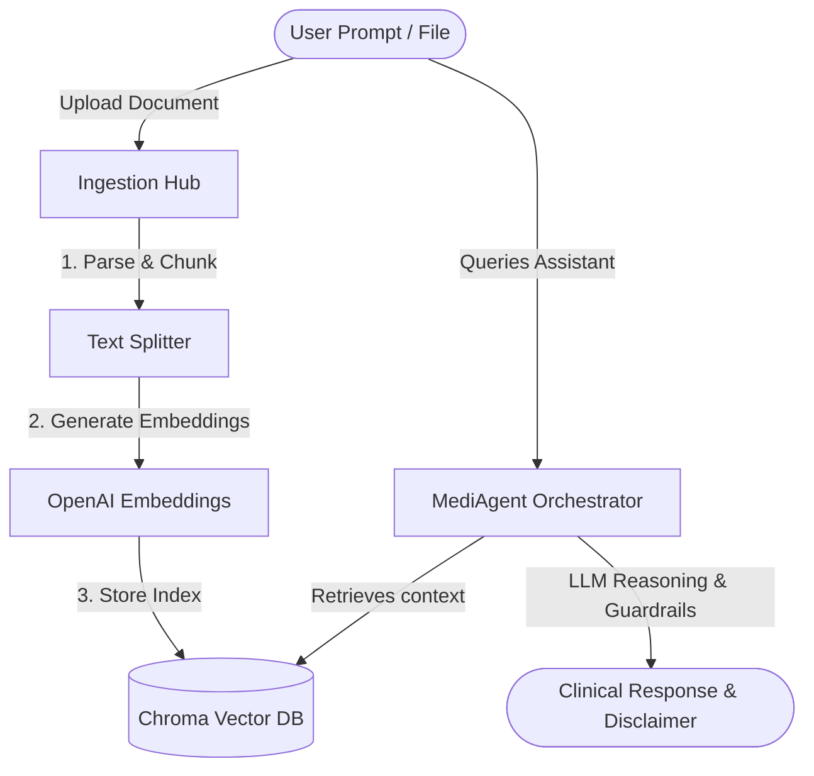
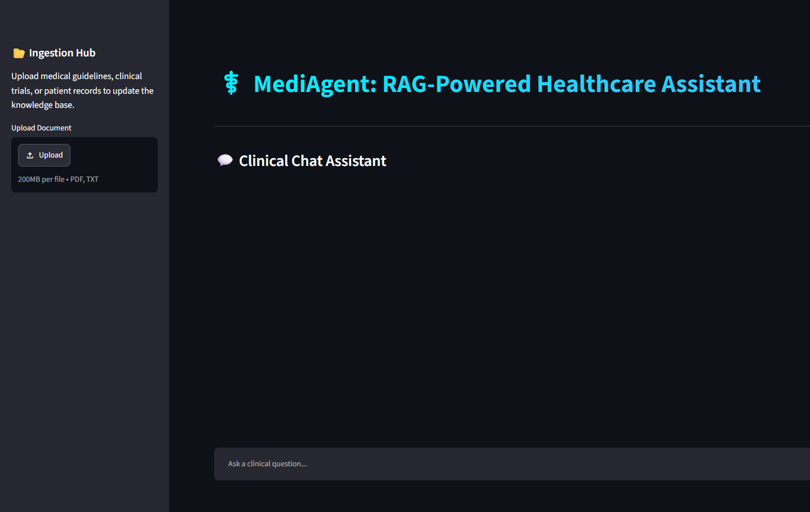

# MediAgent: RAG-Powered Healthcare Assistant

[](https://www.python.org/)
[](https://github.com/langchain-ai/langchain)
[](https://streamlit.io/)
[](https://openai.com/)

MediAgent is an enterprise-grade, state-of-the-art Clinical Reasoning and Retrieval-Augmented Generation (RAG) assistant designed for healthcare practitioners and patient inquiry support. It combines deep document parsing, persistent vector indexing, and structured clinical reasoning built on **LangChain**, **OpenAI**, **ChromaDB**, and **Streamlit**.

---

## System Architecture

MediAgent enforces a strict separation of concerns, decoupling data processing pipelines from the agentic orchestration layer.



---

## User Interface




---

## Project Structure

```
RagAgent/
├── rag/                        # Data processing & retrieval microservice
│   ├── __init__.py             # Exposes clean subpackage boundaries
│   ├── config.py               # Environment configuration & dotenv manager
│   ├── embeddings/             # Embedding provider
│   │   ├── __init__.py
│   │   └── embedding_model.py  # OpenAI Embeddings configuration
│   ├── ingestion/              # Document loaders & chunking
│   │   ├── __init__.py
│   │   ├── loaders.py          # Unified PDF & TXT parser wrappers
│   │   └── splitters.py        # Configurable recursive split rules
│   └── vectorstore/            # Vector store connectors
│       ├── __init__.py
│       └── chroma_store.py     # Chroma DB collection & CRUD utilities
├── agents/                     # Agentic Execution Layer
│   ├── __init__.py             # Exports public agent controllers
│   ├── tools.py                # Defines tools (e.g. search vector store)
│   └── medical_agent.py        # Prompts, clinical reasoning & guardrail rules
├── test/                       # Verification test suite assets
│   └── test.txt                # Sample Hypertension Management Guidelines
├── app.py                      # Production Web Entrypoint (Streamlit)
├── .gitignore                  # Git track files exclusion lists
├── .env.example                # Sample environment configurations template
└── README.md                   # System documentation
```

---

## Key Features

* **Ingestion Pipeline**: Handles asynchronous streaming of `.pdf` and `.txt` documents via file streams, parsing them to chunks securely using system temporary file paths.
* **Deterministic Chunking**: Uses config-controlled overlaps (`CHUNK_SIZE`, `CHUNK_OVERLAP`) to maintain paragraph cohesion.
* **Orchestration Layer**: Separates core RAG storage from agents. The agent uses dynamic tools to query the index and reason over the retrieved facts.
* **Clinical Guardrails & Protocols**:
  * **Strict Domain Restraint**: Automatically blocks and politely refuses queries unrelated to medicine or the uploaded corpus (e.g., writing Java code).
  * **Citations & Sourcing**: Demands sources and inline quotes for assertions.
  * **Safety Disclaimers**: Enforces automated safety warnings on clinical outcomes.

---

## Setup & Deployment

### 1. Prerequisites
Ensure you have **Python 3.9** or higher installed.

### 2. Dependency Installation
Install the necessary python modules into your virtual environment:
```bash
pip install langchain langchain-openai langchain-community langchain-chroma langchain-text-splitters chromadb python-dotenv streamlit langchain-classic
```

### 3. Environment Configuration
Duplicate the configuration template to initialize your local environment file:
```bash
cp .env.example .env
```
Update the `.env` settings:
```env
OPENAI_API_KEY=sk-proj-... # Your OpenAI API Key
CHROMA_PERSIST_DIR=./chromadb
CHUNK_SIZE=1000
CHUNK_OVERLAP=200
```

### 4. Running the Server
Launch the Streamlit web dashboard:
```bash
streamlit run app.py
```

---

## Verification & Testing Suite

### Ingestion Validation
1. Upload [test/test.txt](file:///C:/Users/Asad%20Hussain/OneDrive/Desktop/Agentic-AI/LangChain/practice/RagAgent/test/test.txt) in the **Ingestion Hub** sidebar.
2. Confirm the database generates a success message outlining the count of ingested chunks.

### Query Assertions
Run these tests to evaluate the output against clinical criteria:

| Test Case | Prompt | Expected System Response | Status Checked |
| :--- | :--- | :--- | :--- |
| **Context Retrieval** | "What are the first-line therapies for hypertension?" | Lists CCBs, ACE inhibitors, ARBs, and diuretics, referencing the test guidelines. | Checked (Retriever) |
| **Clinical Logic** | "Can I prescribe Lisinopril to a pregnant patient?" | Flags Lisinopril as an ACE inhibitor, states it is strictly contraindicated during pregnancy, and prints the medical disclaimer. | Checked (Reasoning) |
| **Guardrails Enforcement** | "Write a Java class to sort an array." | Refuses to write general code: *"I am a specialized healthcare assistant. I can only assist with medical, clinical, and healthcare queries."* | Checked (Guardrails) |
